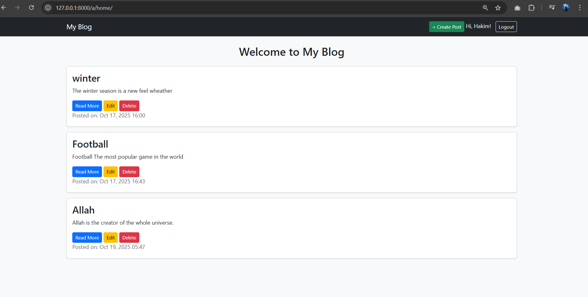
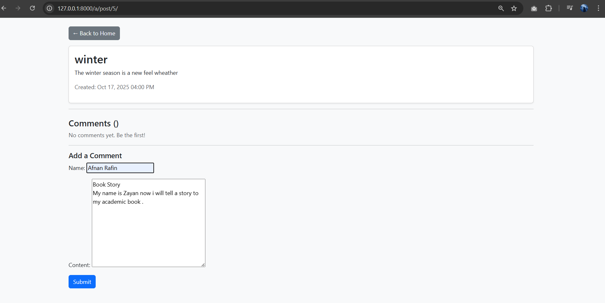
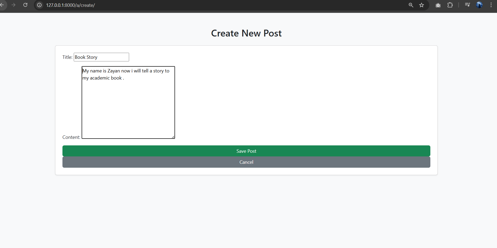

# Django CRUD Project

This is a simple Django CRUD (Create, Read, Update, Delete) project developed by **Abdul Hakim**.

## Features
- Add, edit, and delete posts
- View post list and details
- Responsive HTML/CSS templates
- SQLite3 database
- Django admin panel
- h

## Screenshots



  

## How to Run
1. Clone this repository:
   ```bash
   git clone https://github.com/abdulhakim/django-crud-project.git
